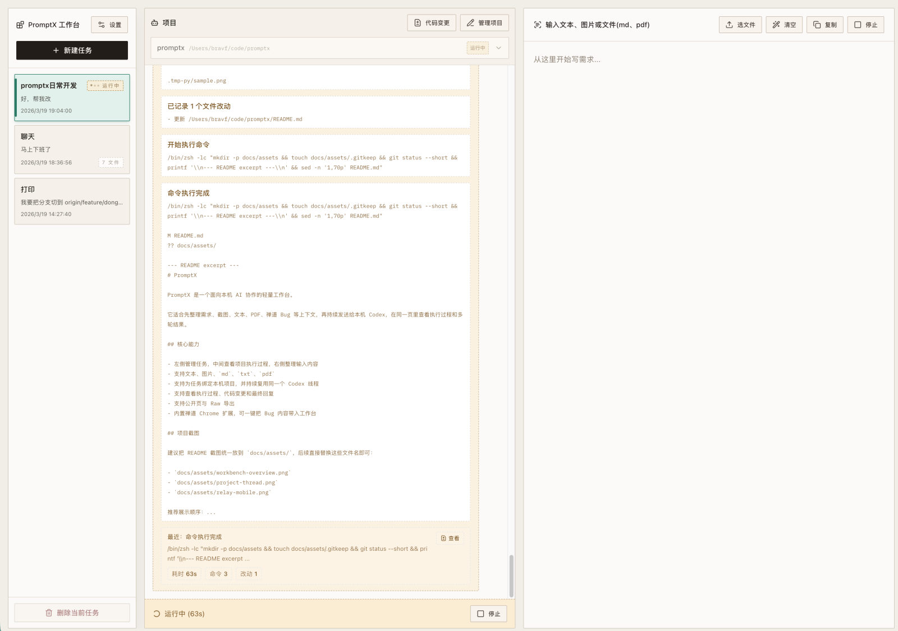
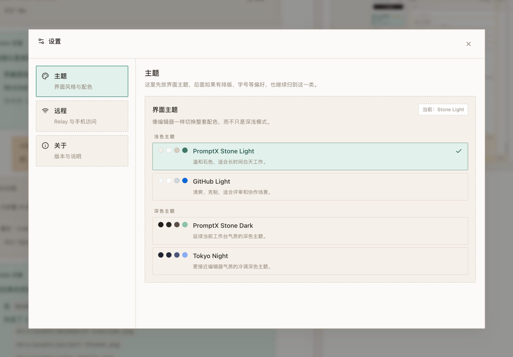
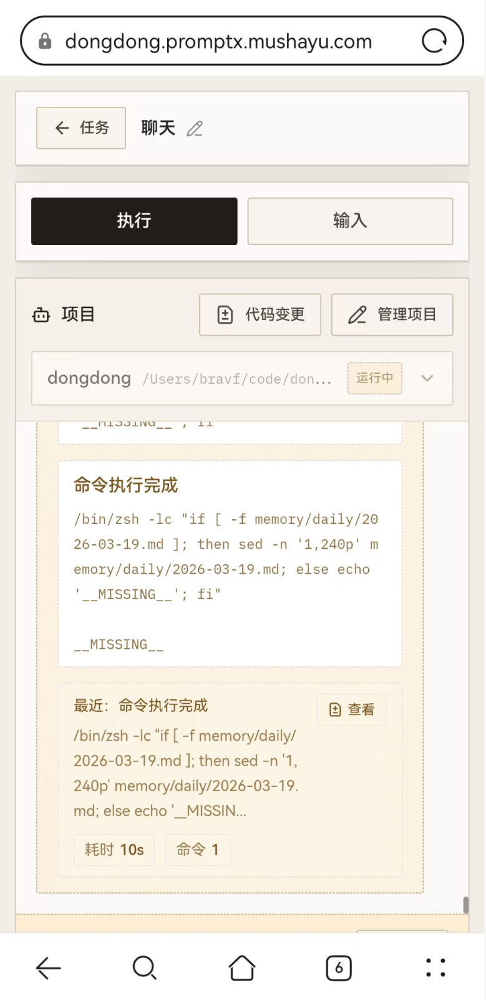

# PromptX

[English README](README.en.md)

PromptX 是一个面向本机 AI Agent 协作的工作台。

它把 `Codex`、`Claude Code`、`OpenCode` 的使用过程整理成一套更顺手的结构：

```text
任务 -> 项目 -> 目录 -> 线程 -> Run -> Diff
```

你继续使用熟悉的 agent CLI，PromptX 负责把输入整理、项目绑定、执行过程、最终回复和代码变更放进同一个工作台里。

## 快速开始

### 运行前提

- 推荐 `Node 22 LTS`
- 当前兼容 `Node 20 / 22 / 24` 稳定版本
- 本机至少安装一个可用执行引擎：
  - `codex --version`
  - `claude --version`
  - `opencode --version`

### 安装

```bash
npm install -g @muyichengshayu/promptx
promptx doctor
```

### 启动

默认地址：`http://127.0.0.1:3000`

```bash
promptx start
promptx status
promptx stop
```

### 怎么用

1. 新建任务，整理本轮要发给 agent 的内容
2. 给任务绑定一个项目
3. 给项目选择工作目录和执行引擎
4. 点击发送，在同一页查看执行过程、最终回复和代码变更

## 核心能力

- 输入整理：支持文本、图片、`md`、`txt`、`pdf`
- 项目复用：一个项目绑定固定目录和执行引擎，持续复用线程上下文
- 过程可见：同页查看执行过程、最终回复、历史 run
- 代码审查：直接查看 workspace / 任务累计 / 单次 run 的 diff
- 多引擎统一：当前支持 `Codex`、`Claude Code`、`OpenCode`
- 远程访问：支持通过 Relay 从手机或外网访问自己的 PromptX

## 系统截图

### 工作台



### 设置



### 手机端



## 为什么好用

- 不用把多轮任务散落在终端和聊天记录里
- 不用每轮都重新交代目录、项目和上下文
- 不只看最终一句回答，还能回看过程和 run 历史
- 改完代码后不用再切回命令行单独看 diff
- 离开电脑后，也能继续在手机上看任务和推进任务

## 适合什么场景

- 先整理需求、截图、日志、文件，再交给 agent 执行
- 一个项目要持续多轮协作，希望稳定复用目录和线程
- 需要同时看执行过程、最终回复和代码改动
- 希望把本机 PromptX 通过 Relay 暴露给手机或外部网络

## 源码开发

```bash
pnpm install
pnpm dev
pnpm build
```

工作区结构：

- `apps/web`：Vue 3 + Vite 前端工作台
- `apps/server`：Fastify 服务端
- `apps/runner`：独立 runner 进程
- `packages/shared`：前后端共享常量与事件协议

## 远程访问

如需使用 Relay，请直接看：

- `docs/relay-quickstart.md`

文档中包含：

- 本地 PromptX 接入 Relay
- 云端 Relay 启动与管理
- 多租户子域名配置
- `promptx relay tenant add/list/remove`
- `promptx relay start/stop/restart/status`

## 禅道扩展

仓库内置了禅道 Chrome 扩展：`apps/zentao-extension`

注意：

- `npm install -g @muyichengshayu/promptx` 安装的正式包不包含该扩展目录
- 如需使用禅道扩展，请克隆源码后手动加载

使用步骤：

1. 打开 `chrome://extensions`
2. 开启开发者模式
3. 点击“加载已解压的扩展程序”
4. 选择 `apps/zentao-extension`

## 注意事项

- 当前以本机单用户使用为主，不包含账号体系和团队权限
- 不同执行引擎的工具能力、输出事件丰富度和稳定性会有差异
- 如需跨设备访问，建议使用 Relay
- 运行数据默认保存在 `~/.promptx/`

## 开源协议

本项目采用 `Apache-2.0` 开源协议，详见 `LICENSE`。
